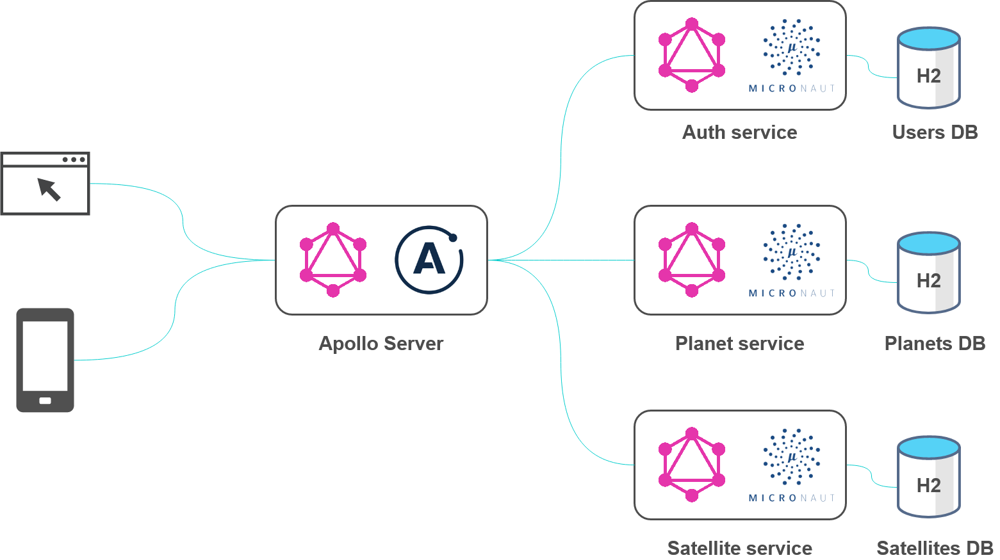
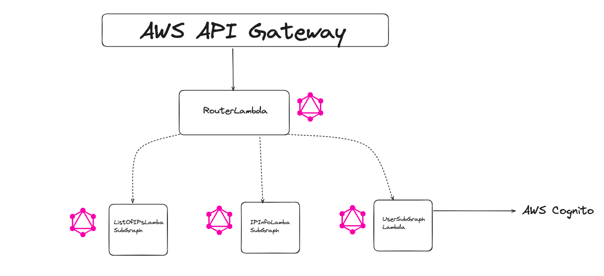

# Times Higher Education Tech Test

## Instructions
Build the following:
• a graphQL server in node using any appropriate library
• an endpoint in the server that accepts an ip address as a query string, or POST
• The endpoint should return the same results that the public API does. However your client must NOT call the public API directly, it should use your server and endpoint
• A unit or integration test for your API endpoint using any framework you choose

BONUS
Extend the API in the following ways:
• A new field is returned called “region_plus_code” that returns the values of “region” and “region_code” where region_plus_code = region + “|” + region_code
• The existing endpoint or a new endpoint allowed a comma-separated list of ip addresses and returns the results for each one

### Setting up
1) Clone the repository
2) enter "npm install" to install the dependencies
3) enter "npm start" to start the server

### Integration testing
To see all the tests passing, enter "npm run test" in the terminal to view the test suite

### Considerations for Scaling & Security

1) Implement GraphQL Federation

The current architecture is well suited for a monolithic application, but for a microservice architecture, it is not optimal. So, to scale up using GraphQL as a key technology, we can implement GraphQL Federation as an architecture. This way we can combine multiple GraphQL API's into a single federated graph. It is made up of subgraph services, and the router/gateway, which is the entry point for the client request. Depending on the request, the router will direct the request to the relevant subgraph. This approach allows flexibility in technology choices, as each subgraph/service can use different technologies, databases or deployment strategies based on its needs.

2) Serverless Architecture
We can host the GraphQL subgraph/services into AWS Lambda functions. We can take advantage from Lambda's operational simplicity, cheap cost and automatic scaling. We can also have AWS API Gateway which routes the request to the Lambda function(s)

3) AWS Cognito
If this project included user sign in/sign up functionality, we can use Cognito for user authentication, which integrates with AWS API Gateway very well.

4) Data Encryption in Transit
Using HTTPS for secure communication between clients and your server, and donfiguring TLS for the load balancers and API Gateway.

